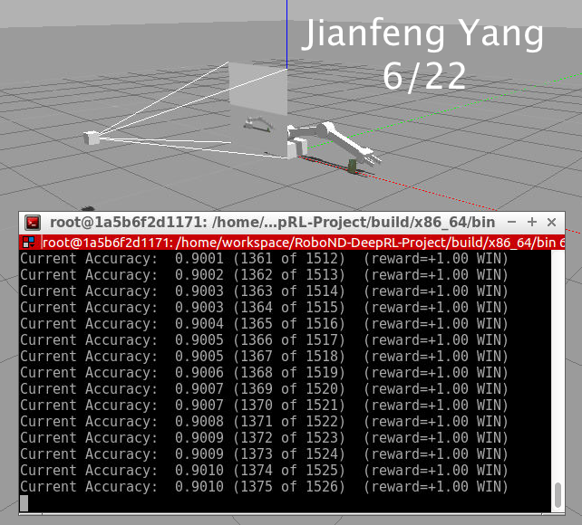

[](https://www.udacity.com/robotics)

# Deep RL Arm Manipulation

## Requirements
1.Create a DQN agent and define reward functions to teach a robotic arm
2.Have the arm perform two primary objectives:
*   Have any part of the robot arm touch the object of interest, with at least a 90% accuracy.
*   Have only the gripper base of the robot arm touch the object, with at least an 80% accuracy.

## Reward functions

#### Reward Types
Based on the goals of the project, there should be three different kinds of rewards, put in two categories:
*   Ending Rewards
    These rewards are issued after each training episode.
    1.  Positive rewards for wins:
    "Win" is defined differently under two different scenarios, namely, either "any part" of the arm touching the tube, or more specifically, only the middle link of the gripper touching the tube.
    2.  Negative rewards for losses:
    "Loss" is defined by such a situation when any part the arm touches the ground, or there are over 100 episode frames, which is considered timeout.
*   Interim Rewards
    This reward is issued during arm movements. It must be defined to encourage the arm to try to decrease the distance between the tube and itself.

In the above definition, a very subtle but vital point that demands attention is that the touching between the ground plane and the tube does not count and needs to be filtered out from the messages. The training was unsuccessful in the beginning because of this very reason.

#### Reward Values
By convention, the winning reward is defined as 1 while the losing reward is defined as -1. The interim reward is defined as the smoothed moving average of the delta of the distance from the tube to the target part of the arm, whether it is any part or just the gripper base.

#### Control Type
Position control is used in this project. For each joint, there are 3 actions to take, and the value is defined by the variable actionJointDelta. Here the default value is not changed.

#### Functions
*   Positive reward
```C++
// onCollisionMsg
void ArmPlugin::onCollisionMsg(ConstContactsPtr& contacts)
{
  // if(DEBUG){printf("collision callback (%u contacts)\n",
  // contacts->contact_size());}

  if (testAnimation)
    return;

  for (unsigned int i = 0; i < contacts->contact_size(); ++i)
  {
    // Check if there is collision between the arm and object, then issue
    // learning reward
    bool contacted = false;

    // check if any contact object is the tube
    if (strcmp(contacts->contact(i).collision1().c_str(), COLLISION_ITEM) ==
        0)
    {
      if (strcmp(contacts->contact(i).collision2().c_str(), COLLISION_PLANE) ==
          0)
        // ground plane contacted, doesn't count
        contacted = false;
      else if (ANY_PART)
        contacted = true;
      else if (strcmp(contacts->contact(i).collision2().c_str(),
                      COLLISION_GRIP_LINK) == 0)
        contacted = true;
      else
        contacted = false;
    }
    else if (strcmp(contacts->contact(i).collision2().c_str(),
                    COLLISION_ITEM) == 0)
    {
      if (strcmp(contacts->contact(i).collision1().c_str(), COLLISION_PLANE) ==
          0)
        // ground plane contacted, doesn't count
        contacted = false;
      else if (ANY_PART)
        contacted = true;
      else if (strcmp(contacts->contact(i).collision1().c_str(),
                      COLLISION_GRIP_LINK) == 0)
        contacted = true;
      else
        contacted = false;
    }

    if (!contacted)
      continue;
    else
    {
      if (DEBUG)
      {
        std::cout << "Collision between[" << contacts->contact(i).collision1()
                  << "] and [" << contacts->contact(i).collision2() << "]\n";
      }

      rewardHistory = REWARD_WIN;

      newReward  = true;
      endEpisode = true;

      return;
    }
  }
}
```
As shown above, on every collision message, the program will perform a check if one of them is the target object. Theoretically, since any contact message will contain two objects, each of them should be examined to see if it is the tube; but in reality, of all the messages received, the tube is always placed in the collision1 attribute. However, the check was still kept to be thorough.

Once it is certain that one of the contacted objects is the tube, a second check is performed. First of all, as mentioned above, the contact between the ground plane and the tube should be filtered out. After that, if the task is to check any part of the arm against the tube, then it can already be inferred that this contact is valid; otherwise, the other object in the contact message is examined to see if it is the gripper base. If yes, a WIN reward will be issued; if not, the program will continue to check the next message.

*   Negative reward

There are two kinds of LOSS: the arm failed to touch the tube within the time frame, or if the gripper touches the ground.

```C++
// episode timeout
if ((maxEpisodeLength > 0) && (episodeFrames > maxEpisodeLength))
{
  printf("ArmPlugin - triggering EOE, episode has exceeded %i frames\n",
         maxEpisodeLength);
  rewardHistory = REWARD_LOSS;
  newReward     = true;
  endEpisode    = true;
}
```
```C++
// get the bounding box for the gripper
const math::Box& gripBBox = gripper->GetBoundingBox();
const float groundContact = 0.05f;

// Set appropriate reward for robot hitting the ground.
if ((float)gripBBox.min.z < groundContact) // touch ground
{
  if (DEBUG)
    printf("GROUND CONTACT, EOE\n");

  rewardHistory = REWARD_LOSS;
  newReward     = true;
  endEpisode    = true;
}
```
In both of the above scenarios, the episode will end immediately, and a negative reward will be issued to discourage the behavior.

*   Interim reward
```C++
// compute the reward from distance to the goal
const float distGoal = BoxDistance(gripBBox, propBBox);

if (DEBUG)
{
  printf("distance('%s', '%s') = %f\n", gripper->GetName().c_str(),
         prop->model->GetName().c_str(), distGoal);
}

if (episodeFrames > 1)
{
  const float distDelta = lastGoalDistance - distGoal;

  // compute the smoothed moving average of the delta of the distance to
  // the goal
  float alpha = 0.32f;

  avgGoalDelta = (avgGoalDelta * alpha) + (distDelta * (1 - alpha));

  if (DEBUG)
    printf("avgGoalDelta: %f\n", avgGoalDelta);

  rewardHistory = avgGoalDelta;
  newReward     = true;
}

lastGoalDistance = distGoal;
```
Except for the two ending rewards, which have a fixed value, an interim reward is dynamically computed and constantly issued in each episode. Here, the smoothed moving average of the delta of the distance to the goal is used as the reward, and the variable alpha serves as a hyperparameter. The higher the alpha, the more the program will rely on historical data for its next action and less the current delta. In practice, this variable plays a vital role in helping to improve the learning curve.

## Hyperparameters
As seen in the code, these are the hyperparameters after tweaking:
```C++
#define INPUT_WIDTH 64
#define INPUT_HEIGHT 64
#define OPTIMIZER "RMSprop"
#define LEARNING_RATE 0.005f
#define REPLAY_MEMORY 20000
#define BATCH_SIZE 64
#define USE_LSTM true
#define LSTM_SIZE 128
```
Compare the values with the provided ones:
```C++
#define INPUT_WIDTH   512
#define INPUT_HEIGHT  512
#define OPTIMIZER "None"
#define LEARNING_RATE 0.0f
#define REPLAY_MEMORY 10000
#define BATCH_SIZE 8
#define USE_LSTM false
#define LSTM_SIZE 32
```
For a starter, I choose to use RMSprop as the optimizer and a learning rate of 0.01f, following the "catch" example. I first set the arm up to touch the tube with "any part" of it. After making all the necessary coding, I found my arm is not learning, and the response is very slow, and sooner or later I would get a "failed to alloc cuda buffer" error.

The parameters need tweaking. First of all, the input was 512 x 512, which is comparatively large. The printed information in the terminal reveals that the images taken by the camera are way smaller, 64 x 64 to be precise. All the extra sizes were wasting the processing power. So the input size was changed to be the same 64 x 64. Furthermore, the REPLAY_MEMORY was doubled to 20000, and the BATCH_SIZE was increased to 64, to make the arm learn from more historical data.

The arm starts to learn a bit, appears to be leaning towards the object, sometimes very close. However, the process seems to be random. The training process was repeated many times, and the performance is volatile. Sometimes the arm can touch the tube on the first try, while other times it would just shake left and right without even trying to get closer.

It seems like the arm is not learning well from its past success. To address this, LSTM was enabled, and the cell size increased to 128.

Finally, the arm appears to be learning normally. A problem that was still haunting was that it could not keep the accuracy. It would keep touching the tube if it succeeded for one time, but if it ever decided to move away, it would keep doing that too. It seems like the interim reward is not tuned correctly, and the arm was relying a little too much on the historical data than on the current one.

Thus, the alpha was lowered, and it did help in stabilizing the accuracy. A few different numbers were tried, and the learning rate was also lowered to 0.001, and finally, the accuracy reached 90%.

For the second objective, there are no significant changes to the hyperparameters. The only thing I noticed at the end of the previous training is that the training time is very long: needs to run over 1500 times to reach the 90% accuracy.

Considering that the second objective should be harder, it may take even longer time. So the learning rate was increased to 0.005.

## Results

Here is the screenshot of the first objective:



Along with a GIF:


And the result for the second objective is shown below:


Also with a GIF to show it dynamically:


Generally speaking, the DQN agent is performing well. As seen from the screenshot, the second training was better than the first one, reaching 80% accuracy in about half the time.

Apart from several coding errors that are undoubtedly due to the unfamiliarity of the library, a few obstacles have severely slowed down the training. First of all, when checking the contact, I was over thinking the problem and checking all the contact messages. Instead, I should be checking only the ones containing the tube. This modification has dramatically speeded things up.

Secondly, when setting up the interim reward, I misunderstood the meaning of the formula and falsely assume that the reward and the smoothed average should be negatively related. The result was that the arm would learn, but with the wrong objective as to stay away as far as possible from the tube.

## Improvements

The above is just a basic implementation to reach the goal, and there are numerous ways to improve it. Name a few:

1.  Choose a different optimizer. RMSprop was the only optimizer that was used, and there might be other ones that are better suited for the task.
2.  Increase REPLAY_MEMORY and BATCH_SIZE further.
3.  Investigate and develop a better formula for the interim reward. Primarily, the alpha is a fixed number during each training. The training should converge even quicker if this alpha can be changed dynamically to reward a faster success than a slower one.
4.  Perform the training on a local machine with lower learning rate and for a more extended period.
5.  Randomize the tube respawn location. So farm the tube location in each episode is a constant. This location can be randomly changed to make things more challenging.
6.  Unlock the arm base. Like the tube location, the revolute joint on the arm's base remains fixed, so the arm movement is limited in a plane, which effectively makes it a 2D movement. Unlocking this joint would undoubtedly improve the arm's ability to handle objects in a 3D environment.
